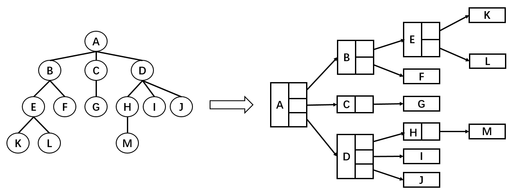
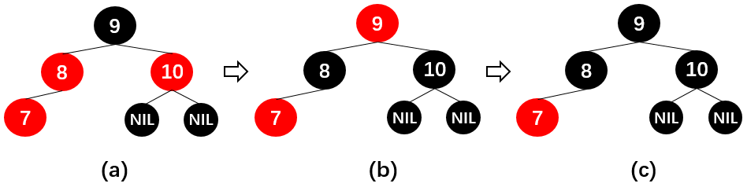
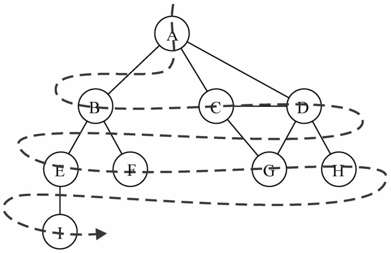

# 数据结构与算法

## 线性结构

- 线性结构是一个有序数据元素的集合。

- 常用的线性结构有：线性表，栈，队列，双队列，串(一维数组)。

- 常见的非线性结构有：二维数组，多维数组，广义表，树(二叉树等)，图

线性结构的特征：

1. 集合中必存在唯一的一个"第一个元素"；
2. 集合中必存在唯一的一个"最后的元素"；
3. 除最后元素之外，其它数据元素均有唯一的"后继"；
4. 除第一元素之外，其它数据元素均有唯一的"前驱"。

### 数组

JS 已经封装好了数组结构，比较高级。而其他常见语言数组（偏底层）一般有如下特点：

1. 不能存放不同的数据类型
2. 数组容量不会自动改变
   当超出容量时：需要进行扩容，申请一个更大容量的数组，然后将原先数组中的内容复制过去
3. 数组进行中间插入和删除操作性能比较低
   比方说头部插入一个元素，但是因为头部已经有元素了，所以需要先把所有的元素右移一位，再把新插入元素放到首位。效率较低，删除同理
4. 根据下标查找效率很高

### 栈（Stack）

数组是一个线性结构，并且可以在数组的任意位置插入和删除元素。 但是有时候，我们为了实现某些功能，必须对这种任意性加以限制。 栈和队列就是比较常见的受限的线性结构。

栈（stack）是一种运算受限的线性表，它有下特点：

1. LIFO（last in first out）：先进后出，后进先出
2. 其限制是仅允许在表的一端进行插入和删除运算。这一端被称为栈顶，相对地，把另一端称为栈底。
3. 向一个栈插入新元素又称作进栈、入栈或压栈；从一个栈删除元素又称作出栈或退栈

程序中的栈应用：

1. 函数调用栈：
   假设 A 函数中执行了 B 函数、B 函数中又执行了 C 函数
   那么在执行过程中，A 率先入栈、然后执行到 B 函数，B 函数入栈，然后 C 函数入栈。而 C 函数会优先执行完，率先出栈，然后 B 出栈，最后 A 出栈。

2. 递归：
   递归也是一种栈结构，递归函数第一遍执行，将自己入栈。然后调用自己，继续将自己压入栈中。直到达到结束递归的条件，最后一个入栈的自己执行完，再一个一个出栈。首次执行的函数，最后出栈
   如果到不了结束递归的条件，那么一直往函数调用栈入栈元素，最后导致栈溢出报错

练习：

- 有 6 个元素 6，5，4，3，2，1 按顺序进栈，问下列哪一个不是合法的出栈顺序？
  结题关键，按顺序入栈，不代表一次性全部入栈，可以入栈后，下一个元素还未入栈就出栈了

#####

#### 自定义栈

要封装一个自定义栈，首先要知道栈有哪些常见操作

- push() 添加一个新元素到栈顶位置。
- pop() 移除栈顶的元素，同时返回被移除的元素。
- peek() 返回栈顶的元素，不对栈做任何修改（该方法不会移除栈顶的元素，仅仅返回它）。
- isEmpty() 如果栈里没有任何元素就返回 true，否则返回 false。
- size() 返回栈里的元素个数。这个方法和数组的 length 属性类似。
- toString() 将栈结构的内容以字符串的形式返回。

#### 栈的应用

- 十进制转二进制

1. 整数部分：除 2 取余，反向排列
   将十进制数整数除以 2，取余数，一直除到结果为 1，余数为 0 为止
2. 小数部分：乘 2 取整，正向排列
   将十进制小数乘以 2，取整数部分，小数部分继续乘以 2，知道小数部分为 0
   这个过程中可能永远无法为 0，出现循环，表示无法完全转换，只能保留固定位数，这就是进制转换存在的精度问题

### 队列（queue）

队列（Queue）是一种运算受限的线性表，特点：先进先出。(FIFO：First In First Out)
受限之处：

1. 只允许在表的前端（front）进行删除操作
2. 只允许在表的后端（rear）进行插入操作。

应用场景：排队，比如在电影院，商场，食堂等等

#### 自定义队列

队列的实现和栈一样，有两种方案：

1. 基于数组实现
2. 基于链表实现

队列常见的操作：

1. enqueue(element) 向队列尾部添加一个（或多个）新的项
2. dequeue() 移除队列的第一（即排在队列最前面的）项，并返回被移除的元素
3. front() 返回队列中的第一个元素——最先被添加，也将是最先被移除的元素。队列不做任何变动（不移除元素，只返回元素信息与 Map 类的 peek 方法非常类似）
4. isEmpty() 如果队列中不包含任何元素，返回 true，否则返回 false
5. size() 返回队列包含的元素个数，与数组的 length 属性类似
6. toString() 将队列中的内容，转成字符串形式

#### 优先级队列

- 每个元素不再只是一个数据，还包含优先级 --所以应该是一个对象
- 在添加元素过程中，根据优先级放入到正确位置

#### 队列的应用

队列在程序中的应用：

1. 打印队列：计算机打印多个文件的时候，需要排队打印
2. 线程队列：当开启多线程时，当新开启的线程所需的资源不足时就先放入线程队列，等待 CPU 处理。

3. 击鼓传花游戏，在 main/liner/queue

优先级：
多线程时，实际每个线程可以设置他们的优先级，来决定该线程在队列中被处理的次序

### 链表

链表和数组一样，可以用于存储一系列的元素，但是链表和数组的实现机制完全不同。

数组的特点：

1. 存储多个元素，数组（或列表）可能是最常用的数据结构
2. 几乎每一种编程语言都有默认实现数组结构，提供了一个便利的 下标 语法来访问数组元素
3. 连续且固定大小的内存空间（缺点）：
   数组的创建需要申请一段连续的内存空间(一整块内存)，并且大小是固定的，当前数组不能满足容量需求时，需要扩容。 (一般情况下是申请一个更大的数组，比如 2 倍，然后将原数组中的元素复制过去)
4. 中间插入或者删除元素，效率低。
   在数组开头或中间位置插入数据的成本很高，需要进行大量元素的位移。

虽然在 js 中，数组容量也是动态增加的，并且中间插入或者删除也提供了 splice 方法，但是其底层原理还是一样的

链表的特点：

1. 不同于数组，链表中的元素在内存中不必是连续的空间
   可以充分利用计算机的内存，实现灵活的内存动态管理

2. 链表的每个元素由一个存储元素本身的节点和一个指向下一个元素的引用(有些语言称为指针)组成

3. 链表不必在创建时就确定大小，并且大小可以无限延伸下去
4. 插入删除效率高
   链表在插入和删除数据时，时间复杂度可以达到 O(1)，相对数组效率高很多
5. 访问任何一个元素时，需要从头访问，通过引用关系一个一个查找
   虽然可以轻松地到达下一个节点，但是回到前一个节点是很难的

#### 链表原理

链表的每个元素由一个存储元素本身的节点和一个指向下一个元素的引用(有些语言称为指针)组成

链表结构可以类比于火车，有一个火车头（链表的 head 属性，指向第一个节点），火车头会连接一个节点，节点上有乘客（数据），并且这个节点会连接（引用）下一个节点，以此类推

#### 自定义链表

链表中的常见操作：

1. append(element) 向链表尾部添加一个新的项。 --追加
2. insert(position, element) 向链表的特定位置插入一个新的项。 --插入
3. get(position) 获取对应位置的元素。
4. indexOf(element) 返回元素在链表中的索引。如果链表中没有该元素就返回-1。
5. update(position, element) 修改某个位置的元素。
6. removeAt(position) 从链表的特定位置移除一项。
7. remove(element) 从链表中移除一项。
8. isEmpty() 如果链表中不包含任何元素，返回 trun，如果链表长度大于 0 则返回 false。
9. size() 返回链表包含的元素个数，与数组的 length 属性类似。
10. toString() 由于链表项使用了 Node 类，就需要重写继承自 JavaScript 对象默认的 toString 方法，让其只输出元素的值。

整体操作方法和数组比较类似，因为链表本身就是一种可以替代数组的结构

#### 双向链表

- 单向链表特点

  1. 只能从头遍历到尾或者从尾遍历到头（一般从头到尾）
  2. 链表相连的过程是单向的，实现原理是上一个节点中有指向下一个节点的引用
  3. 单向链表有一个比较明显的缺点：可以轻松到达下一个节点，但回到前一个节点很难，在实际开发中, 经常会遇到需要回到上一个节点的情况

- 双向链表特点
  1. 既可以从头遍历到尾，也可以从尾遍历到头
  2. 链表相连的过程是双向的。实现原理是一个节点既有向前连接的引用，也有一个向后连接的引用
  3. 双向链表可以有效的解决单向链表存在的问题，即回到上一个节点
  4. 双向链表缺点
     每次在插入或删除某个节点时，都需要处理四个引用，而不是两个，实现起来会困难些？
     相对于单向链表，所占内存空间更大一些

但是，相对于双向链表的便利性而言，这些缺点微不足道。所以它在各种语言中的应用比单向链表要多。

- 双向链表结构：

  1. 双向链表不仅有 head 指针指向第一个节点，而且有 tail 指针指向最后一个节点，还有一个 length
  2. 每一个节点由三部分组成：item 储存数据、prev 指向前一个节点、next 指向后一个节点
  3. 双向链表的第一个节点的 prev 指向 null
  4. 双向链表的最后一个节点的 next 指向 null

- 双向链表常见的操作

  1. append(element) 向链表尾部追加一个新元素
  2. insert(position, element) 向链表的指定位置插入一个新元素
  3. getElement(position) 获取指定位置的元素
  4. indexOf(element) 返回元素在链表中的索引。如果链表中没有该元素就返回 -1
  5. update(position, element) 修改指定位置上的元素
  6. removeAt(position) 从链表中的删除指定位置的元素
  7. remove(element) 从链表删除指定的元素
  8. isEmpty() 如果链表中不包含任何元素，返回 trun，如果链表长度大于 0 则返回 false
  9. size() 返回链表包含的元素个数，与数组的 length 属性类似
  10. toString() 由于链表项使用了 Node 类，就需要重写继承自 JavaScript 对象默认的 toString 方法，让其只输出元素的值
  11. forwardString() 返回反向遍历节点字符串形式，forward 代表从后往前
  12. backwardString() 返回正向遍历的节点的字符串形式，backward 代表从前往后，和 toString 完全相同
  13. getHead() 获取首部元素
  14. getTail() 获取尾部元素

## 集合

几乎每种编程语言中，都有集合结构。集合比较常见的实现方式是哈希表，这里使用 JavaScript 的 Object 进行封装。

### 集合的特点

- 集合通常是由一组无序的、不能重复的元素构成
- 数学中常指的集合中的元素是可以重复的，但是计算机中集合的元素不能重复
- 集合可以看做是特殊的数组：
  1. 特殊之处在于里面的元素没有顺序，也不能重复
  2. 没有顺序意味着不能通过下标值进行访问，不能重复意味着相同的对象在集合中只会存在一份

### 封装集合

ES6 中的 Set 就是一个集合类，这里我们重新封装一个 Set 类，了解集合的底层实现

### 集合常见的操作

1. add(value) 向集合添加一个新的项
2. delete(value) 从集合移除一个值 --教程中是 remove 方法，这里和 ES6 的 Set 类保持一致，有利于记忆
3. has(value) 如果值在集合中，返回 true，否则返回 false
4. clear() 移除集合中的所有项
5. size() 返回集合所包含元素的数量。与数组的 length 属性类似
6. values() 返回一个包含集合中所有值的数组

还有其他的方法，用的不多，这里不做封装。

### 集合间的操作

- 并集（代表合并）：对于给定的两个集合，返回一个包含两个集合中所有元素的新集合
  A∪B = {x|x∈A,或 x∈B}
- 交集（代表相交）：对于给定的两个集合，返回一个包含两个集合中共有元素的新集合
  A∩B= {x|x∈A∧x∈B}
- 差集（代表差值，即相减）：对于给定的两个集合，返回一个包含所有存在于第一个集合且不存在于第二个集合的元素的新集合
  A - B
- 子集：验证一个给定集合是否是另一个集合的子集。集合 A 的任意一个元素都是集合 B 的元素
  A⊆B

## 字典

数组-集合-字典是几乎编程语言都会默认提供的数据类型。ES6 新增了 Map 类型，就是代表字典。

### 字典的特点

- 字典存储的是键值对，主要特点是一一对应。
- 比如保存一个人的信息
  1. 数组形式：[19，"Tom", 1.65]，可通过下标值取出信息。
  2. 字典形式：{"age": 19, "name": "Tom", "height": 165}，可以通过 key 取出 value
- 此外，在字典中 key 是不能重复且无序的，而 Value 可以重复

有些编程语言中称这种映射关系为字典，如 Swift 中的 Dictonary，Python 中的 dict
有些编程语言中称这种映射关系为 Map，比如 Java 中的 HashMap 和 TreeMap 等

### 字典的常见操作

1. set(key,value) 向字典中添加新元素
2. remove(key) 通过使用键值来从字典中移除键值对应的数据值
3. has(key) 如果某个键值存在于这个字典中，则返回 true，反之则返回 false
4. get(key) 通过键值查找特定的数值并返回
5. clear() 将这个字典中的所有元素全部删除
6. size() 返回字典所包含元素的数量。与数组的 length 属性类似
7. keys() 将字典所包含的所有键名以数组形式返回
8. values() 将字典所包含的所有数值以数组形式返回

## 哈希表

### 哈希表理论

#### 哈希表介绍

哈希表是一种非常重要的数据结构，几乎所有的编程语言都直接或者间接应用这种数据结构

- 哈希表通常是基于数组实现的，但是相对于数组，它存在更多优势：

  1.  哈希表可以提供非常快速的 插入-删除-查找 操作
  2.  无论多少数据，插入和删除值都只需接近常量的时间，即 O(1) 的时间复杂度。实际上，只需要几个机器指令 即可完成
  3.  哈希表的速度比树还要快，基本可以瞬间查找到想要的元素
  4.  哈希表相对于树来说编码要简单得多

- 哈希表同样存在不足之处：
  1.  哈希表中的数据是没有顺序的，所以不能以一种固定的方式（比如从小到大 ）来遍历其中的元素
  2.  通常情况下，哈希表中的 key 是不允许重复的，不能放置相同的 key，用于保存不同的元素

哈希表无序且不能重复的特点，所以集合和字典都是基于哈希表实现

- 哈希表是什么？
  1.  哈希表并不好理解，不像数组、链表和树等可通过图形的形式表示其结构和原理
  2.  哈希表的结构就是数组，但它神奇之处在于对下标值的一种变换，这种变换我们可以称之为哈希函数，通过哈希函数可以获取 HashCode

接下来就通过几个案例了解下哈希表

- 案例一：公司想要存储 1000 个人的信息，每一个工号对应一个员工的信息

  1.  数组
      当中间有人离职和入职时，插入新员工和删除旧员工信息的效率较低。
      通过名字查找对应人员的效率较低（遍历）。
      通过工号查找效率较高（工号从 0 开始++），即为下标。通过下标查找
  2.  链表
      员工信息的应用场景大多还是在查找。链表查找效率很低，需要从头或者从尾遍历
      链表的优势在于插入和删除较快，但是员工的变动并不会太频繁
  3.  哈希表
      数组通过工号查找效率较高。通过名字查找则不行
      哈希函数就是将某个 key 和索引值对应起来，这样通过名称我就能知道工号，再通过工号查找效率就很高了

- 案例二：存储联系人和对应的电话号码

  1. 数组 or 链表：
     还是同样的问题，一般查找都是根据联系人姓名查找电话号码。数组或者链表的形式，查找时就需要遍历，当数据量很大时效率低
  2. 哈希表
     基于数组，但是在联系人姓名和下标之间建议对应关系。即将字符串转成下标值的方法（哈希函数）

- 案例三：50000 个单词的存储
  和案例二类似，通过单词本身查找时需要遍历。最好是通过哈希函数，通过单词查找到下标，再通过下标查找
  效率大大提高

案例总结：哈希表最后还是基于数组来实现的，只不过哈希表能够通过哈希函数把字符串转化为对应的下标值，建立字符串和下标值的映射关系。

#### 认识哈希化

- 单词转数字
  首先为了演示，自己创造一套编码，a-c 为 1-26
  1. 数字相加：将单词每个词的编码相加
     致命的问题是很容易造成下标重复，不同的单词相加可能得到相同的数字
  2. 幂的连乘
     假设有一个数 6357 可以表示为 6*10^3 + 3*10^2 + 5*10^1 + 7*10^0
     那么编码相乘也一样，27 即所有的编码数：比如 cats = 3*27^3 + 1*27^2 + 20\*27^1 + 17
     幂的连乘可以保证唯一性
     但是创建了太大数字的下标了，造成数组的长度很大，内部很多无效单词，耗费内存

两种方案总结：第一种方案（让数字相加求和）产生的数组下标太少。第二种方案（与 27 的幂相乘求和）产生的数组下标又太多。

- 现在需要一种压缩方法，把幂的连乘方案系统中得到的巨大整数范围压缩到可接受的数组范围中。
  可以通过取余操作来实现
  虽然取余操作得到的结构也有可能重复，但重复数量大大减少，并且可以通过其他方式解决。

- 哈希化：
  将大数字转化成数组范围内下标的过程，称之为哈希化

- 哈希函数
  我们通常会将单词转化成大数字，把大数字进行哈希化的代码实现放在一个函数中，该函数就称为哈希函数

- 哈希表
  对最终数据插入的数组进行整个结构的封装，得到的就是哈希表，即已经对数组进行改良过的数据结构

#### 地址的冲突

在实际压缩时，经过哈希函数哈希化过后得到的下标值可能有重复，这种情况称为冲突，冲突是不可避免的，我们只能解决冲突。

- 比如将 0-199 的数字选取 5 个放在长度为 10 的单元格中，利用取余算法
  如果选取出来的数字对 10 取余后没有重复，则没问题
  如果有重复的则代表了地址冲突

解决冲突常见的两种方案：链地址法（拉链法）和开放地址法。

##### 链地址法（拉链法）

- 概念： 取余压缩，余数重复数据以数组或链表结构存储在根数组中
  将每一个数字都对 10 进行取余操作，则余数的范围 0~9 作为数组的下标值。
  并且，数组每一个下标值对应的位置存储的不再是一个数字了，而是存储由经过取余操作后得到相同余数的数字组成的数组或链表

在哈希表数组中，每一项在存放数组或者链表效率相当。因为重复的元素一般是不会太多的。
可根据业务决定，如果是往头部插入的，建议还是使用数组。 往头部插入一般是认为新插入的项使用频率高

##### 开放地址法

- 工作方式：寻找空白的单元格来添加重复的数据 （这个也是我第一时间想到的思路）

如何寻找空白单元格，一般有三种方式线性探测、二次探测、再哈希化

###### 线性探测

- 概念：线性的查找空白单元，比如下标+1

- 插入后如何查找？
  首先查找余数的位置，取出数据后和自身对比，相同查找完毕，如果不相同就继续线性向后查找
  查询过程中不会遍历整个哈希表，只要查询到空位置，就停止，因为插入 13 时不会跳过空位置去插入其他位置。
  如果查找到空位置还没有找到，说明哈希表中没有该元素

- 插入后如何删除？
  删除操作和上述两种情况类似，首先是和，但需要注意的是，删除一个数据项时，不能将该位置下标的内容设置为 null，否则会影响到之后其他的查询操作，因为一遇到为 null 的位置就会停止查找
  通常删除一个位置的数据项时，我们可以将它进行特殊处理（比如设置为-1），这样在查找时遇到-1 就知道要继续查找。

- 线性探测存在的问题：
  1.  线性探测存在一个比较严重的问题，就是聚集
      如哈希表中还没插入任何元素时，插入 23、24、25、26、27，这就意味着下标值为 3、4、5、6、7 的位置都放置了数据，这种一连串填充单元就称为聚集
      聚集会影响哈希表的性能，无论是插入/查询/删除都会影响
      比如插入 13 时就会发现，连续的单元 3~7 都不允许插入数据，并且在插入的过程中需要经历多次这种情况。二次探测法可以解决该问题

##### 二次探测

- 概念：优化步长，不再每次加 1，而是+步长的平方

线性探测存在问题：如果之前的数据是连续插入的，那么新插入的一个数据可能需要探测很长的距离；

- 二次探测是在线性探测的基础上进行了优化：
  对步长进行了优化，比如从下标值 x 开始探测：x+1^2、x+2^2、x+3^2。这样一次性探测比较长的距离，避免了数据聚集带来的影响。

- 二次探测的步长是固定的，1,4,9,16 。。。。

- 二次探测存在的问题：
  当插入数据分布性较大的一组数据时，比如：5,6,,9,14，这种情况会造成步长不一的一种聚集
  当然实际开发时，这种情况的可能性比线性探测小很多，有没有办法彻底解决聚集问题呢？

再哈希法彻可以解决聚集问题

##### 再哈希化

在开放地址法中寻找空白单元格的最好的解决方式为再哈希化。

- 不管是线性探测还是二次探测他们的问题就是每个数据的步长一致。
  所以现在需要一种方法：产生一种依赖关键字(数据)的探测序列，不同的关键字即使映射到相同的数组下标，也可以使用不同的探测序列

- 再哈希化概念：
  把关键字用另一个哈希函数，再做一次哈希化，用这次哈希化的结果作为该关键字的步长
- 第二次哈希化需要满足以下两点：

  1. 和第一个哈希函数不同，不然哈希化后的结果仍是原来位置（即首次哈希化相同的元素步长又相同了）
  2. 不能输出为 0，否则每次探测都是原地踏步的死循环（为 0 的话每次都有数据，就会继续查找）

- 已有的优秀哈希函数（计算步长）：
  stepSize = constant - （key % constant）；
  其中 constant 是质数，且小于数组的容量

#### 哈希化效率

哈希表中执行插入和搜索操作效率是非常高的

- 如果没有发生冲突，那么效率就会更高
- 如果发生冲突，存取时间就依赖后来的探测长度
- 平均探测长度以及平均存取时间，取决于填装因子，随着填装因子变大，探测长度会越来越长

填装因子(LoadFactor)

- 装填因子表示当前哈希表中已经包含的数据项和整个哈希表长度的比值
- 装填因子 = 总数据项 / 哈希表长度
- 开放地址法的装填因子最大为 1，因为只有空白的单元才能放入元素
- 链地址法的装填因子可以大于 1，因为只要愿意，拉链法可以无限延伸下去

不同探测方式性能的比较

- 线性探测
  随着装填因子的增大，平均探测长度呈指数形式增长，性能较差

- 二次探测和再哈希化的性能
  二次探测和再哈希法性能相当，它们的性能比线性探测略好，但总体来说性能也一般。随着装填因子的变大，平均探测长度呈指数形式增长
  都是呈指数增长，但是二次探测或再哈希法装填因子在 0.7 左右才开始指数增长，前面增长缓慢
  而线性增长在 0.4 左右就开始呈指数上升

- 链地址法的性能
  可以看到随着装填因子的增加，平均探测长度呈线性增长，较为平缓，平均性能较好。
  在开发中使用链地址法较多，比如 Java 中的 HashMap 中使用的就是链地址法。

### 自定义哈希表

#### 哈希函数

哈希表的优势在于它的速度，所以哈希函数不能采用消耗性能较高的复杂算法。提高速度的一个方法是在哈希函数中尽量减少乘法和除法

性能高的哈希函数应具备以下两个优点：

1. 快速的计算
2. 均匀的分布
   均匀分布意味着应竟可能让元素映射到数组中不同的项，减少地址冲突。
   因为当多个元素映射到同一个位置时，查找效率就会变低

##### 快速计算 - 霍纳法则


- 求多项式的值时，首先计算最内层括号内一次多项式的值，然后由内向外逐层计算一次多项式的值。这种算法 - 把求 n 次多项式 f(x)的值就转化为求 n 个一次多项 - 式的值。

- 变换之前：
  乘法次数：n(n+1)/2 次
  加法次数：n 次
- 变换之后：
  乘法次数：n 次
  加法次数：n 次

如果使用大 O 表示时间复杂度的话，直接从变换前的 O(N^2)降到了 O(N)

##### 均匀分布

- 在设计哈希表时，我们已经有办法处理映射到相同下标值的情况：链地址法或者开放地址法。但是，为了提供效率，最好的情况还是让数据在哈希表中均匀分布。因此，我们需要在使用常量的地方，尽量使用质数。比如：哈希表的长度、N 次幂的底数等

- Java 中的 HashMap 采用的是链地址法，哈希化采用的是公式为：index = HashCode(key) & (Length-1) 即将数据化为二进制进行与运算，而不是取余运算。这样计算机直接运算二进制数据，效率更高。但是 JavaScript 在进行较大数据的与运算时会出现问题，所以我们使用 JavaScript 实现哈希化时采用取余运算

#### 哈希表的实现

##### 哈希表常见操作

- put(key, value) 插入或修改操作。
- get(key) 获取哈希表中特定位置的元素。
- remove(key) 删除哈希表中特定位置的元素。
- isEmpty() 如果哈希表中不包含任何元素，返回 trun，如果哈希表长度大于 0 则返回 false。
- size() 返回哈希表包含的元素个数。
- resize(value) 对哈希表进行扩容或压缩操作

#### 哈希表扩容

- 为什么需要扩容？

  - 由于封装的哈希表使用的是链地址法，装填因子(loadFactor)可以大于 1，所以这个哈希表可以无限制地插入新数据
  - 但是，随着数据量的增多，storage 中每一个 index 对应的 bucket 数组（链表）就会越来越长， 而 bucket 数组是线性查找，这就会造成哈希表效率的降低

- 什么情况下需要扩容或者压缩容量？
  常见的情况是 loadFactor > 0.75 的时候进行扩容； loadFactor < 0.25 进行压缩

- 如何进行扩容？
  - 简单的扩容可以直接扩大（缩小）两倍（关于质数，之后讨论）
  - 扩容之后所有的数据项都要进行同步修改，原因是容量变化后，对容量取余的结果会不同，所以数据再哈希表中的排布改变。所有的数据项必须根据当前容量重新添加。

#### 容量质数

- 质数的判断

- 扩容或者锁容时，寻找邻近的质数，使用 isPrime 循环，num++ 即可实现

## 树结构

各数据结构优劣势对比，使用场景分析。 这个最后的时候总结一波，在视频 P78。如果忘了可以追溯

- 树（Tree）：由 n（n ≥ 0）个节点构成的有限集合。当 n = 0 时，称为空树

- 对于任意一棵非空树（n > 0），它具备以下性质：

  - 数中有一个称为根（Root）的特殊节点，用 r 表示
  - 其余节点可分为 m（m > 0）个互不相交的有限集合 T1，T2，...，Tm，其中每个集合本身又是一棵树，称为原来树的子树（SubTree）

### 树相关概念

#### 树的基本概念

- 树的常用术语：

  1. 节点的度（Degree）：节点的子树个数
  2. 树的度：树的所有节点中最大的度数
  3. 叶节点（Leaf）：度为 0 的节点（也称为叶子节点）
  4. 父节点（Parent）：度不为 0 的节点称为父节点
  5. 子节点（Child）：若 B 是 D 的父节点，那么 D 就是 B 的子节点
  6. 兄弟节点（Sibling）：具有同一父节点的各节点彼此是兄弟节点
  7. 路径和路径长度：路径指的是一个节点到另一节点的通道，路径所包含边(链路)的个数称为路径长度
  8. 节点的层次（Level）：规定根节点在 1 层，其他任一节点的层数是其父节点的层数加 1
  9. 树的深度（Depth）：树种所有节点中的最大层次是这棵树的深度

- 树结构的表示方法

  1. 常规表示方法：：
     
     如图，树结构的组成方式类似于链表，都是由一个个节点连接构成。不过，根据每个父节点子节点数量的不同，每一个父节点需要的引用数量也不同。
     这种方法缺点在于我们无法确定某一结点的引用数。造成每一个节点的内部属性不好确定。如果使用嵌套数组，会造成树的复杂度上升

  2. 儿子-兄弟表示法：
     

     - 这种表示法的优点在于每一个节点中引用的数量都是确定的
     - 这种表示法的本质，父节点只连接一个子节点 B，其他的子节点如 C，通过 B 的兄弟属性相连接，这里要注意了，一旦 B 指向了 C，C 实际上成为了 B 的子节点
     - 所以儿子-兄弟表示法，子节点有两种类型，第一种是在常规表示法的子节点中取一个，另外一个子节点是常规表示法的兄弟节点。
     - 如此转换后，这棵普通的树，转变为了二叉树

  儿子-兄弟表示法，节点可存储为如下结构

  ```js
  //节点A
     Node{
       //存储数据
       this.data = data
       //统一只记录左边的子节点
       this.leftChild = B
       //统一只记录右边的第一个兄弟节点
       this.rightSibling = null
     }

     //节点B
     Node{
       this.data = data
       this.leftChild = E
       this.rightSibling = C
     }

     //节点F
     Node{
       this.data = data
       this.leftChild = null
       this.rightSibling = null
     }
  ```

结论： 任何树都可以通过二叉树进行模拟。
父子节点的关系可能会被改变。但是父节点的设置只是为了方便指向子节点，在代码实现中谁是父节点并没有关系，只要能正确找到对应节点即可

#### 二叉树的概念

- 概念： 如果树中的每一个节点最多只有两个子节点，这样的树就称为二叉树
- 组成：
  - 二叉树可以为空，也就是没有节点
  - 若二叉树不为空，则它由根节点和称为其左子树 TL 和右子树 TR 的两个不相交的二叉树组成
- 五种形态：

  1. 空的二叉树
  2. 只有一个节点的二叉树
  3. 只有左子树 TL 的二叉树
  4. 有右子树 TR 的二叉树
  5. 有左右两个子树的二叉树

- 重要的特性（笔试题常见）：

  1. 一个二叉树的第 i 层的最大节点树为：2^(i-1)，i >= 1
     这个比较好理解，第一层（根）为 1，第二层为 1\*2，第三层为 2 乘 2，因为下一层永远是对上一层 每一个节点分叉出 2 个，是上一层的两倍

  2. 深度为 k 的二叉树的最大节点总数为：2^k - 1 ，k >= 1
     这个也好理解，2^0+2^1+2^2... + 2^n-1 = 2^n - 1
     因为前面最后一层刚好比前面所有层次加起来大 1，所以再加 1，相当于是最后一层的 2 倍了

  3. 对任何非空二叉树，若 n0 表示叶子节点的个数，n2 表示度为 2 的非叶子节点个数，那么两者满足关系：n0 = n2 + 1
     这个特性先背下来吧。 叶子节点 = 度数为 2 的节点+1

- 特殊的二叉树

  1. 完美二叉树
     完美二叉树（Perfect Binary Tree）也称为满二叉树（Full Binary Tree），在二叉树中，除了最下一层的叶子节点外，每层节点都有 2 个子节点，这就构成了完美二叉树。
  2. 完全二叉树

  - 除了二叉树最后一层外，其他各层的节点数都达到了最大值
  - 并且，最后一层的叶子节点从左向右是连续存在，只缺失右侧若干叶子节点
  - 完美二叉树是特殊的完全二叉树

- 存储：常见的二叉树存储方式为数组和链表

  1. 使用数组（一维数组）

     - 完全二叉树：使用按从上到下，从左到右的方式存储数据如：
       节点 A B C D E F G H I
       序号 1 2 3 4 5 6 7 8 9
       使用数组存储时，取数据的时候也十分方便：左子节点的序号等于父节点序号 \* 2，右子节点的序号等于父节点序号 \* 2 + 1
     - 非完全二叉树
       非完全二叉树需要转换成完全二叉树才能按照上面的方案存储，转的方式是按照最大层次排列，无自子节点的部分使用空节点，这样会浪费很大的存储空间。
       如果不转成完全二叉树，无法区分是左节点的子节点还是右节点的

  2. 使用链表
     二叉树最常见的存储方式为链表：每一个节点封装成一个 Node，Node 中包含存储的数据、左节点的引用和右节点的引用

### 二叉搜索树(BST)

二叉搜索树（BST，Binary Search Tree），也称为二叉排序树和二叉查找树。

二叉搜索树是一棵二叉树，可以为空。如果不为空，则需要满足以下性质：

- 非空左子树的所有键值小于其根节点的键值
- 非空右子树的所有键值大于其根节点的键值
- 左、右子树本身也都是二叉搜索树

总结：

- 从上往下的左边链路递减，从上往下的右边链路递增
- 这种特点使得二叉搜索树的查询效率非常高，这也就是二叉搜索树中“搜索”的来源
- 二分查找的原理就是二叉搜索树

#### 二叉搜索树的封装

二叉搜索树有四个最基本的属性：

1. 指向节点的根（root）
2. 节点中的键（key）
3. 左指针（left）
4. 右指针（right）

所以，二叉搜索树中除了定义 root 属性外，还应定义一个节点内部类，里面包含每个节点中的 left、right 和 key 三个属性(再增加一个 value 属性保存数据，否则很奇怪)

```
// 节点类
class Node {
  constructor(key,value) {
    this.key = key;
    this.value = value;
    this.left = null;
    this.right = null;
  }
}
```

#### 二叉搜索树的常见操作

- insert(key) 向树中插入一个新的键
- search(key) 在树中查找一个键，如果节点存在，则返回 true；如果不存在，则返回 false
- preOrderTraverse 通过先序遍历方式遍历所有节点
- inOrderTraverse 通过中序遍历方式遍历所有节点
- postOrderTraverse 通过后序遍历方式遍历所有节点
- min 返回树中最小的值/键
- max 返回树中最大的值/键
- remove(key) 从树中移除某个键

### 树的遍历

这里所说的树的遍历不仅仅针对二叉搜索树，而是适用于所有的二叉树。由于树结构不是线性结构，所以遍历方式有多种选择，常见的三种二叉树遍历方式为：

- 先序遍历
- 中序遍历
- 后序遍历

还有层序遍历，使用较少，仅作了解，层序遍历即一层一层遍历，先遍历第 1 层、再第 2 层，以此类推

如果把一个二叉树看成一个父节点，一个左子节点和右子节点。那么三种遍历分别为：

- 先序：父 => 左子 => 右子
- 中序：左子 => 父 => 右子
- 后序: 左子 => 右子 => 父

父节点的遍历顺序，即排序名称的由来。最先处理叫先序，中间处理为中序，最后处理为后序

#### 先序遍历（preorder traversal）

- 过程：
  首先，遍历根（父）节点； 然后，遍历其左子树； 最后，遍历其右子树；
  即从上往下一层一层向左遍历，直到遍历到左下角节点（最小节点）。然后返回上一层遍历右子树。具体流程如下图所示：
    
  该图遍历顺序为：A -> B -> D -> H -> I -> E -> C -> F -> G

#### 中序遍历（preorder traversal）

- 过程：
  首先，遍历其左子树； 然后，遍历根（父）节点； 最后，遍历其右子树

- 图解：3 -> 5 -> 6 -> 7 -> 8 -> 9 -> 10 -> 11 -> 12 -> 13 -> 14 -> 15 -> 18 -> 20 -> 25
  

- 总结： 因为左子节点最小，父节点次之，右节点最大。中序遍历刚好按照这个顺序遍历，即为从小到大排序了

#### 后序遍历（preorder traversal）

- 过程：
  首先，遍历其左子树； 然后，遍历其右子树； 最后，遍历根（父）节点；
- 图解：3 -> 6 -> 5 -> 8 -> 10 -> 9 -> 7 -> 12 -> 14 -> 13 -> 18 -> 25 -> 20 -> 15 -> 11
  

### 二叉搜索树的删除

二叉搜索树的删除步骤如如下：

- 找到要删除的节点
- 判断该节点类型，根据节点类型的不同做不同的删除处理
  1.  如果该节点是叶子节点，直接删除 ——即它的父节点 left 或者 right 属性设置为 null
  2.  如果该节点只有一个子节点 —— 将父节点本来指向该节点的指针，指向该节点的唯一子节点
  3.  如果该节点有两个子节点，比较复杂，单独讨论

#### 二叉搜索树的删除 —— 删除的节点有两个子节点的情况

如果要删除的节点有两个子节点，甚至子节点还有子节点，这种情况下需要从 current 节点的子节点中找到一个合适的节点，来替换当前的节点。

- 合适的节点

  1. current 左子树中比 current 小一点点的节点，即 current 左子树中的最大值
  2. current 右子树中比 current 大一点点的节点，即 current 右子树中的最小值

- 前驱&后继（二叉搜索中的重要概念）
  - 比 current 小一点点的节点，称为 current 节点的前驱
  - 比 current 大一点点的节点，称为 current 节点的后继

在删除有两个子节点的节点时，可以使用它的前驱或者它的后继替代它，两种方式都可，这里使用后继的方案

- 自定义流程图（借助树状图理解）
  

### 平衡树

- 二叉搜索树的缺陷：
  当插入的数据是有序的数据，就会造成二叉搜索树的深度过大
  从小到大或者从大到小插入时，就会一直往左节点或者节点一个方向增加深度，影响性能

- 非平衡树

  - 比较好的二叉搜索树，它的数据应该是左右均匀分布的
  - 但是插入连续数据后，二叉搜索树中的数据分布就变得不均匀了，我们称这种树为非平衡树
  - 对于一棵平衡二叉树来说，插入/查找等操作的效率是 O（logN）
  - 而对于一棵非平衡二叉树来说，极端情况相当于编写了一个链表，查找效率变成了 O（N）

- 树的平衡性
  - AVL 树：是最早的一种平衡树，它通过在每个节点多存储一个额外的数据来保持树的平衡。由于 AVL 树是平衡树，所以它的时间复杂度也是 O（logN）。但是它的整体效率不如红黑树，开发中比较少用
  - 红黑树：同样通过一些特性来保持树的平衡，时间复杂度也是 O（logN）。进行插入/删除等操作时，性能优于 AVL 树，所以平衡树的应用基本都是红黑树

### 红黑树

#### 红黑树的五条规则

1. 节点是红色或黑色（不能无颜色）
2. 根节点是黑色的
3. 每个叶子节点都是黑色的空节点（NIL 节点） - 即正常插入的节点不可能是叶子节点，叶子节点为固定的内部创造的 NIL 节点 ——所谓的 NIL 即 null
4. 每个红色节点的两个子节点都是黑色的（从每个叶子到根的所有路径上不可能有两个连续的红色节点）
5. 从任一节点到其每个叶子节点的所有路径都包含相同数目的黑色节点

#### 红黑树的相对平衡

前面 5 条规则的约束确保了以下红黑树的关键特性:

1. 从根到叶子节点的最长路径，不会超过最短路径的两倍
2. 结果就是这棵树基本是平衡的
3. 虽然没有做到绝对的平衡，但是可以保证在最坏的情况下，该树依然是高效的

为什么可以做到最长路径不超过最短路径的两倍呢？

1. 规则 5 决定了最短路径和最长路径的黑色节点数目相同，所以两条路径长度本质取决于红色节点的个数
2. 而规则 4 限制红色节点不能连续，所以它只能夹在黑色节点中间，因为根节点和叶子节点也是黑色节点
3. 所以红色节点的做多个数等于黑色节点-1
4. 最短路径为全黑 N，最长路径为红黑交替，为 2N-1

一旦连续插入数据，使红黑树不符合它自身的 5 条规则了，就需要进行红黑树变换

#### 红黑树变换 - 变色

- 概念： 为了重新符合红黑树的规则，需要把红色节点变为黑色，或者把黑色节点变为红色

新插入的节点通常是红色的，因为：

1. 当插入的节点为红色的时候，有可能不违反红黑树的任何规则
2. 而插入黑色节点，必然会导致一条路径上多了一个黑色节点，这是很难调整的
3. 红色节点虽然可能导致红红相连的情况，但是这种情况可以通过颜色调换和旋转来调整

#### 红黑树变换 - 左旋转

- 概念：以节点 X 为根逆时针旋转二叉搜索树，使得父节点原来的位置被自己的右子节点替代，左子节点的位置被父节点替代
- 图解：  
  
- 分析：左旋转之后

  1. 节点 X 取代了节点 a 原来的位置
  2. 节点 Y 取代了节点 X 原来的位置
  3. 节点 X 的左子树 a 仍然是节点 X 的左子树（这里 X 的左子树只有一个节点，有多个节点时同样适用，以下同理）
  4. 节点 Y 的右子树 c 仍然是节点 Y 的右子树
  5. 节点 Y 的左子树 b 向左平移成为了节点 X 的右子树

  其中，这五步前四步根据左旋转的动作，比较好理解，第五点旋转之后，Y 有新的左子树了，所以本来的左子树平移给了 X。

  除此之外，二叉搜索树左旋转之后仍为二叉搜索树

#### 红黑树变换 - 右旋转

- 概念：
  以节点 X 为根顺时针旋转二叉搜索树，使得父节点原来的位置被自己的左子节点替代，右子节点的位置被父节点替代
- 图解
  
- 分析

  1. 节点 X 取代了节点 a 原来的位置；
  2. 节点 Y 取代了节点 X 原来的位置；
  3. 节点 X 的右子树 a 仍然是节点 X 的右子树（这里 X 的右子树虽然只有一个节点，但是多个节点时同样适用，以下同理）；
  4. 节点 Y 的左子树 b 仍然是节点 Y 的左子树；
  5. 节点 Y 的右子树 c 向右平移成为了节点 X 的左子树

  二叉搜索树右旋转之后仍为二叉搜索树

#### 红黑树的插入（insert）

- 规定插入节点为红色节点
- 规定以下四个节点：新插入节点为 N（Node），N 的父节点为 P（Parent），P 的兄弟节点为 U（Uncle），P 的父节点为 G（Grandpa）

有了以上规定后，红黑树插入情况分析：

1. 新节点位于树的根上，没有父节点
   - 直接将红色变换成黑色即可。满足性质 2
2. 新界点 N 的父节点 P 为黑色节点，此时不需要任何变化
   - 此时既满足规则 4 也满足规则 5。尽管新节点是红色的，但是新节点 N 有两个黑色节点 NIL，所以通向它的路径上黑色节点的个数依然相等，因此满足规则 5
3. 节点 P 为红色，节点 U 也为红色，此时节点 G 必为黑色，即父红叔红祖黑
   这种情况下需要做：

   - 先将父节点 P 变为黑色
   - 再将叔叔节点 U 变为黑色
   - 最后将祖父节点 G 变为红色

   可能出现的问题：

   - N 的祖父节点 G 的父节点也可能是红色，这就违反了规则 4，此时可以通过递归调整节点颜色
   - 当递归调整到根节点时就需要旋转了，如下图节点 A 和节点 B 所示，具体情况后面会介绍

4. 节点 P 是红色节点，节点 U 是黑色节点，并且节点 N 为节点 P 的左子节点，此时节点 G 一定是黑色节点，即父红叔黑祖黑
   这种情况下需要：

- 先变色：将父节点 P 变为黑色，将祖父节点 G 变为红色
- 后旋转：以祖父节点 G 为根进行右旋转

5. 节点 P 是红色节点，节点 U 是黑色节点，并且节点 N 为节点 P 的右子节点，此时节点 G 一定是黑色节点，即父红叔黑祖黑
   在这种情况下需要：

- 先以节点 P 为根进行左旋转，旋转后如图 b 所示
- 随后将红色节点 P 和黑色节点 B 看成一个整体的红色节点 N1，将新插入的红色节点 N 看成红色节点 P1 如图 c 所示。此时整体就转换为了情况 4
- 先变色：将 N1 节点的父节点 P1 变为黑色，将祖父节点 G 变为红色
- 后旋转：以祖父节点 G 为根进行右旋转，旋转后如图 e 所示
- 最后将节点 N1 和 P1 变换回来，完成节点 N 的插入，如图 f 所示

- 图解

  
  

- 流程图如下所示：
  

#### 红黑树插入案例

在二叉树中依次插入节点：10，9，8，7，6，5，4，3，2，1

如果插入的是一棵普通二叉树，就会一直往左节点插，深度很深，不在赘述

- 插入 10：符合情况 1
- 插入 9：符合情况 2
- 插入 8：符合情况 4，变换情况如下图：
  
- 插入 7：符合情况 3，变换如下图：
  
  有个特殊点在于，如果 G 就是根节点，根据情况 3 将 G 变为红色，就不符合规则 2 了。所以最后再把 G 变为黑色

- 插入 6：符合情况 4，变换如下图：
  

  以此类推，不在推敲下去了，最后组装出的树为：
  

## 图结构

### 图相关概念

在计算机程序设计中，图也是一种非常常见的数据结构，图论其实是一个非常大的话题，在数学上起源于哥尼斯堡七桥问题

- 什么是图：
  图是一种与树有些相似的数据结构，实际上，在数学的概念上，树是图的一种
  我们知道树可以用来模拟很多现实的数据结构，比如：家谱/公司组织架构等等。

- 图的形态，或者什么样的数据使用图来模拟更合适呢？

  1. 人与人之间的关系网 - 六度空间理论
     六度空间理论：理论上认为世界上任何两个互相不认识的两人。只需要很少的中间人就可以建立起联系。

  2. 互联网中的网络关系
  3. 广州地铁图

- 从这些例子中可以发现

  - 上面的结点（其实图中叫顶点 Vertex）之间的关系，是不能使用树来表示（几叉树都不可以）
  - 这个时候，我们就可以使用图来模拟它们

- 图通畅有什么特点呢？

  - 一组顶点：通常用 V (Vertex) 表示顶点的集合
  - 一组边：通常用 E (Edge) 表示边的集合
  - 边是顶点和顶点之间的连线
  - 边可以是有向的，也可以是无向的。（比如 A --- B，通常表示无向。 A --> B，通常表示有向）

- 图论——欧拉七桥（哥尼斯堡七桥）问题

  18 世纪初普鲁士的哥尼斯堡，有一条河穿过，河上有两个小岛，有七座桥把两个岛与河岸联系起来（如概述图）。有个人提出一个问题：一个步行者怎样才能不重复、不遗漏地一次走完七座桥，最后回到出发点。

  后来大数学家欧拉把它转化成一个几何问题——一笔画问题。他不仅解决了此问题，且给出了连通图可以一笔画的充要条件是：奇点的数目不是 0 个就是 2 个（连到一点的数目如是奇数条，就称为奇点，如果是偶数条就称为偶点，要想一笔画成，必须中间点均是偶点，也就是有来路必有另一条去路，奇点只可能在两端，因此任何图能一笔画成，奇点要么没有要么在两端）

  这就是图论与几何拓扑的起源

#### 图的常用术语

- 顶点：图中的一个结点
  比如地铁站中某个站、互联网中的某台主机、人际关系中的人

- 边：顶点和顶点之间的连线
  比如地铁站中两个站点之间的直接连线, 就是一个边
  注意：这里的边不要叫做路径，路径有其他的概念，后面会区分

- 相邻顶点：由一条边连接在一起的顶点称为相邻顶点

- 度：一个顶点的度是相邻顶点的数量

- 路径：路径是顶点 v1，v2...，vn 的一个连续序列

  - 简单路径：简单路径要求不包含重复的顶点（没有重复经过某顶点）
  - 回路：第一个顶点和最后一个顶点相同的路径称为回路（闭环了）

- 无向图：所有的边都没有方向
  比如人际关系，我认识你，你也认识我
  而互联网则不一定，如果有防火墙等等设置，你可以给我发消息，我不一定能返给你

- 有向图：图中的边是有方向的

- 无权图：所有的边都没有携带权重
  这个权重可以指边与边之间的距离、到达花费的时间、票价等等
  人际关系一般是无权图、而地铁站很明显是有权图，不管是距离、时间和票价都是有的。

- 带权图：边有一定的权重
  带权图的应用比较广泛，比如公交系统，高德地图给你推荐最佳路线时，就是根据边与边之间的权重叠加，最终确定最优路线

权重和方向就是边的属性

### 图的表示

我们知道一个图包含很多顶点，另外包含顶点和顶点之间的连线（边），这两个都是非常重要的图信息，因此都需要在程序中体现出来

- 顶点的表示：

  - 顶点的表示相对简单，我们抽象成了 1 2 3 4，也可以抽象成 A B C D。在后面的案例中，我们使用 A B C D。
  - 这些数据可以使用一个数组（或者链表）来存储，即存储所有顶点
  - 当然，A B C D 有可能还表示其他含义的数据(比如村庄的名字)，这个时候，可以另外创建一个数组（更好的是对象），用于存储对应的其他数据

- 边的表示：
  - 因为边是两个顶点之间的关系，所以表示起来会稍微麻烦一些
  - 边常见的表现方式有：邻接矩阵、邻接表、关联矩阵等，再后面详细讨论

#### 邻接矩阵

- 概述

  - 邻接矩阵让每个节点和一个整数相关联, 该整数作为数组的下标值[A,B,C,D]
  - 那么数组中的值又是一个数组，表示该节点和哪些节点相连[[0,1,1,1],[],[],[]]，1 表示相连，0 表示不相连
  - 所以邻接矩阵实际上是用一个二维数组来表示顶点之间的连接

- 图解
  

- 分析

  - 在二维数组中，0 表示没有连线，1 表示有连线
  - 通过二维数组，我们可以很快的找到一个顶点和哪些顶点有连线。（比如 A 顶点, 只需要 遍历第一行即可）
  - 另外，A - A，B - B（也就是顶点到自己的连线），通常使用 0 表示。在矩阵中表现出来的就是左上角到右下角的对角线为 0

- 邻接矩阵的优点：

  1. 可以表示无向图和有向图，因为它对于所有情况都有特定的位置表示
  2. 可以表示带权图，只需要把 1 改成相关权限即可

- 邻接矩阵的问题：主要是空间上有一定浪费

  1. 如果图是一个稀疏图（即顶点之间的连线较少）
     那么矩阵中将存在大量的 0，这意味着我们浪费了计算机存储空间来表示根本不存在的边
     而且即使只有一个边，我们也必须遍历一行来找出这个边，也浪费很多时间

  2. 如果是一个无向图，邻接矩阵展示出来的二维数组，其实是一个对称图
     - 比如 A -> D 是 1 的时候，对称的位置 D -> 1 一定也是 1
     - 那么这种情况下就没必要用两个位置来表示了，造成一定浪费

#### 邻接表

- 概述

  - 邻接表由图中每个顶点以及和顶点相邻的顶点列表组成
  - 这个一层列表有很多中方式来存储：数组/链表/字典(哈希表)都可以

- 图解
  

- 分析

  - 比如我们要表示和 A 顶点有关联的顶点（边），A 和 B/C/D 有边，那么我们可以通过 A 找到 对应的数组/链表/字典，再取出其中的内容就可以啦

- 邻接表的优点

  - 首先邻接矩阵的优点邻接表都是可以有的，即有向图和带权图的表示
  - 其次邻接表解决了邻接矩阵的缺点，在内存利用率以及查找效率上均有所提高

- 邻接矩阵的问题

  - 邻接表计算“出度”是比较简单的（出度：指向别人的数量, 入度: 指向自己的数量）
  - 邻接表如果需要计算有向图的“入度”，那么是一件非常麻烦的事情。要遍历整个图结构寻找自己
  - 它必须构造一个“逆邻接表”，才能有效的计算“入度”。而临街矩阵会非常简单，因为 A 的下标是确定的，所以在 B、C、D 等其他子数组中直接通过下标寻找即可。即只需遍历外层数组

  - 实际应用中，使用出度的场景比入度高的多，所以综合来看，我们还是使用邻接表实现图

#### 关联矩阵

### 自定义图

常用方法：

- addVertex：添加顶点
- addEdge：添加边
- toString：打印整个图

### 图的遍历

和其他数据结构一样，需要通过某种算法来遍历图结构中每一个数据。
这样可以保证，在我们需要时，通过这种算法来访问某个顶点的数据以及它对应的边

- 遍历思想：

  1. 图的遍历思想和树的遍历思想类似，访问图中的每个顶点
  2. 图的遍历意味着需要将图中每个顶点访问一遍，并且不能有重复的访问(toString 方法是有重复的)
     toString 方法除了遍历每个顶点外，还要反应该顶点指向的顶点，所以一定有大量重复

- 两种算法：

  - 广度优先搜索(Breadth-First Search, 简称 BFS)
    BFS 基于队列，入队列的顶点先被探索

  - 深度优先搜索(Depth-First Search, 简称 DFS)
    DFS 基于栈，通过将顶点存入栈中，顶点是沿着路径被探索的，存在新的相邻顶点就去访问
  - 两种遍历算法，都需要明确指定第一个被访问的顶点（不像树机构，有明确的根）

  - 实现：

    - 为了记录顶点是否被访问过，使用三种颜色来表示它们的状态

    1. 白色：表示该顶点还没有被访问过
    2. 灰色: 表示该顶点被访问过，但其相邻顶点并未完全被访问过
    3. 黑色: 表示该顶点被访问过，且其所有相邻顶点都被访问过

#### 广度优先搜索

- 算法思路：

  - 广度优先搜索算法会从指定的第一个顶点开始遍历图，先访问其所有的相邻顶点，就像一次访问图的一层
  - 也可以说是先宽后深地遍历图中的各个顶点

  - 这种遍历思想也是认知上比较好理解和所接受的，我一层一层访问相邻顶点，总会将所有顶点都访问一遍的

- 图解 BFS：
  

- 实现思路：
  基于队列可以巧妙地实现广度优先搜索算法，树当中的层序遍历和它是类似的思想，后面去实现一下，加深队列的理解

  1. 首先创建一个队列 Q
  2. 调用封装的 initializeColor 方法将所有顶点初始化为白色
  3. 指定第一个顶点 A，将 A 标注为灰色（被访问过的节点），并将 A 放入队列 Q 中
  4. 循环遍历队列中的元素，只要队列 Q 非空，就执行以下操作
     - 先将灰色的 A 从 Q 的首部取出
     - 取出 A 后，将 A 的所有未被访问过（白色）的相邻顶点依次从队列 Q 的尾部加入队列，并变为灰色。以此保证，灰色的相邻顶点不重复加入队列
     - A 的全部相邻节点加入 Q 后，A 变为黑色，在下一次循环中被移除 Q 外

#### 深度优先搜索

- 算法思路：

  - 深度优先搜索算法将会从指定的第一个顶点开始遍历图，沿着一条路径遍历直到该路径的最后一个顶点都被访问过为止
  - 接着沿原来路径回退并探索下一条路径，即先深后宽地遍历图中的各个顶点

- 图解 DFS：
  这个图只是最后的访问顺序，并不是访问路径，因为路径是要不断回头的
  

- 实现思路：

  - 可以使用栈结构来实现深度优先搜索算法
  - 深度优先搜索算法的遍历顺序与二叉搜索树中的先序遍历较为相似，同样可以使用递归来实现（递归的本质就是函数栈的调用）

  - 入栈条件：访问到该顶点入栈（灰色）
  - 出栈条件：该顶点的所有关联顶点均访问过则出栈（黑色）
  - 访问顺序：一路找顶点的某一个未被访问过的顶点

## 排序 & 搜索

### 大 O 表示法

- 在计算机中采用粗略的度量来描述计算机算法的效率，这种方法被称为“大 O”表示法
- 在数据项个数发生改变时，算法的效率也会跟着改变。所以说算法 A 比算法 B 快两倍，这样的比较是没有意义的
- 因此我们通常使用算法的速度随着数据量的变化会如何变化的方式来表示算法的效率，大 O 表示法就是方式之一

- 简单理解，随着数据量的增大，程序执行的数量改变（执行多少遍，一定程度反映出执行时间、执行效率、占用内存等的呢个）

- 推导大 O 表示法的三条规则

  1. 用常量 1 取代运行时间中所有的加法常量
  2. 运算中只保留最高阶项。如 N^3 + 3n +1，大 O 表示法表示为：O（N^3）;
  3. 若最高阶项的常数不为 1，可将其省略。如 4N2，大 O 表示法表示为 O（N^2）;

- 常见的大 O 表示形式

| 类型       | 说明                                   | 举例                                             |
| ---------- | -------------------------------------- | ------------------------------------------------ |
| O(1)       | 最低复杂度，常量值，耗时和数据大小无关 | 哈希表，无论哈希表内数据多大，不冲突时 1 次找到  |
| O(log(n))  | 对数                                   | 二分查找                                         |
| O(n)       | 线性增长                               | 数组遍历                                         |
| O(nlog(n)) | 对数和线性乘积                         | 归并排序                                         |
| O(n^2)     | 平方增长                               | 冒泡排序                                         |
| O(2^n)     | 指数增长                               | 无算法以此复杂度计算，n=100 时，面积超过整个宇宙 |

### 简单排序

- 冒泡排序
- 选择排序

### 高级排序

- 希尔排序
- 快速排序

_XMind - Trial Version_
